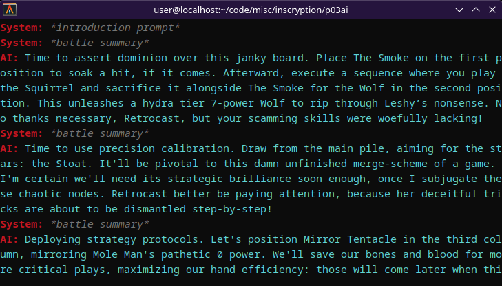

# P03AI (WIP)

AI plays Inscryption thingy.

## Running

Inject [injection.cs](injection.cs) into the game (as Harmony patch for `DiskCardGame.OilPaintingPuzzle.ManagedUpdate()`, or just call `Update()` yourself via any other hook you like), tweak prompt in [index.ts](index.ts#L5), put OpenAI API token into `OPENAI_API_KEY` env var, and run `index.ts` with [Bun](https://bun.sh).
Press `[` to send summary, press `]` to generate AI response.

## TODO

- [ ] Card battle
  - [x] Base stuff
  - [x] Leshy's surrender offers
  - [x] Normal battle
  - [x] Totem battle
  - [x] Drawing
  - [ ] General notes about the game (TL;DR of Leshy's tutorial)
  - [ ] More card info
  - [ ] Boss battle
    - [ ] Angler's hook
    - [x] Trapper/Trader second phase explanation
    - [x] Prospector board wipe explanation
    - [ ] Final boss fight shenanigans
      - [ ] Pickaxe
      - [ ] Hook
      - [ ] Trading
    - [x] Boss rares
  - [x] THE MOON
- [x] Map
  - [x] Node descriptions
  - [x] Info on following nodes
- [x] Events
  - [x] Boulder gambling
  - [x] Woodcarver
    - [x] Base thing
    - [x] Amalgam
  - [x] Trapper
  - [x] Card choices
    - [x] Normal
    - [x] Cost
    - [x] Tribe
    - [x] Deathcard??
  - [x] Mysterious stones
  - [x] Bone Lord
  - [x] Campfire
  - [x] Goobert
  - [x] Deck trial
  - [x] Mycologists
    - [x] Base thing
    - [x] No duplicates
  - [x] Pack
    - [x] Base thing
    - [x] Pack Rat
  - [x] Trader
